<!-- @format -->

/\*_ @format _/

# 💰 COMMISSIONS & PAYOUTS SYSTEM - COMPLETE FLOW

**Date:** December 17, 2025  
**System:** FSM (Field Service Management)  
**Status:** FULLY OPERATIONAL ✅

---

## 📋 Table of Contents

1. [System Overview](#system-overview)
2. [Commission Types](#commission-types)
3. [Complete Flow Diagram](#complete-flow-diagram)
4. [Step-by-Step Process](#step-by-step-process)
5. [Database Schema](#database-schema)
6. [API Endpoints](#api-endpoints)
7. [Calculation Examples](#calculation-examples)
8. [Payout Methods](#payout-methods)
9. [Admin Controls](#admin-controls)
10. [Testing & Verification](#testing--verification)

---

## 🎯 System Overview

The Commission & Payout system automatically calculates and distributes earnings to technicians based on completed work orders.

### Key Concepts:

- **Freelancer Technicians:** Earn **40% commission** on each job
- **Internal Employees:** Earn **5% bonus** on each job + base salary
- **Automatic Calculation:** Commissions created when payment is verified
- **Wallet System:** Real-time balance tracking for freelancers
- **Payout Options:** Weekly auto-payouts or on-demand requests
- **Admin Review:** Manual approval for on-demand payouts

---

## 💵 Commission Types

### 1. **FREELANCER - Commission (40%)**

```
Tech Type: TECH_FREELANCER
Commission Rate: 40% (0.4)
Payment Model: Per-job commission only
Example:
- Job Payment: $100
- Commission: $40 (40%)
- To Wallet: $40
```

**When Applied:**

- ✅ Work order completed
- ✅ Customer payment received
- ✅ Admin verifies payment
- ✅ Commission created automatically
- ✅ Added to wallet instantly

### 2. **INTERNAL EMPLOYEE - Bonus (5%)**

```
Tech Type: TECH_INTERNAL
Bonus Rate: 5% (0.05)
Payment Model: Base salary + performance bonus
Example:
- Job Payment: $100
- Bonus: $5 (5%)
- Base Salary: $800/month (separate)
```

**When Applied:**

- ✅ Work order completed
- ✅ Payment verified
- ✅ Bonus recorded (not added to wallet)
- ✅ Paid with monthly salary

---

## 🔄 Complete Flow Diagram

### Mermaid Flow Diagram

```mermaid
flowchart TB
    Start([🚀 Work Order Created]) --> Assigned[📋 Assigned to Technician]
    Assigned --> Accepted[✅ Technician Accepts]
    Accepted --> InProgress[🔧 Work In Progress]
    InProgress --> Completed[🏁 Work Completed]

    Completed --> CompletedPending[📸 Status: COMPLETED_PENDING_PAYMENT<br/>Upload photos & notes]
    CompletedPending --> Payment[💵 Customer Makes Payment<br/>Cash or Mobile Money]

    Payment --> PaymentRecord[📝 Payment Record Created<br/>Status: PENDING_VERIFICATION<br/>Upload proof]
    PaymentRecord --> AdminVerify{🔍 Admin Verifies Payment}

    AdminVerify -->|Reject| PaymentRejected[❌ Payment Rejected<br/>Technician notified]
    AdminVerify -->|Approve| PaymentVerified[✅ Payment Verified<br/>WO Status: PAID_VERIFIED]

    PaymentVerified --> CheckTechType{👷 Check Tech Type}

    CheckTechType -->|FREELANCER| FreelancerCalc[💰 Calculate Commission<br/>Rate: 40%<br/>Amount = Payment × 0.4]
    CheckTechType -->|INTERNAL| InternalCalc[🎁 Calculate Bonus<br/>Rate: 5%<br/>Amount = Payment × 0.05]

    FreelancerCalc --> CreateCommission[📊 Create Commission Record<br/>Type: COMMISSION<br/>Status: EARNED]
    InternalCalc --> CreateBonus[📊 Create Bonus Record<br/>Type: BONUS<br/>Status: EARNED]

    CreateCommission --> UpdateWallet[💼 Update Wallet<br/>Balance += Commission<br/>Create Transaction: CREDIT]
    CreateBonus --> TrackBonus[📋 Track for Salary Payout<br/>No wallet update]

    UpdateWallet --> NotifyTech[🔔 Push Notification<br/>Commission Earned]
    TrackBonus --> NotifyTech

    NotifyTech --> WaitPayout[⏳ Wait for Payout]

    WaitPayout --> PayoutChoice{💳 Payout Method?}

    PayoutChoice -->|Weekly Auto| WeeklyPayout[📅 Weekly Auto-Payout<br/>Every Sunday 11:59 PM]
    PayoutChoice -->|On-Demand| RequestPayout[📱 Technician Requests<br/>On-Demand Payout]

    WeeklyPayout --> ProcessWeekly[⚙️ System Processes<br/>1. Find all EARNED<br/>2. Group by technician<br/>3. Create payout records]

    RequestPayout --> PayoutRequest[📝 Create Payout Request<br/>Status: PENDING<br/>Amount: Requested]
    PayoutRequest --> AdminReview{🔍 Admin Reviews Request}

    AdminReview -->|Reject| RequestRejected[❌ Request Rejected<br/>Notify technician]
    AdminReview -->|Approve| ProcessOnDemand[✅ Process Payout<br/>Create payout record]

    ProcessWeekly --> MarkPaid[✏️ Mark Commissions PAID<br/>Link to payout]
    ProcessOnDemand --> MarkPaid

    MarkPaid --> DeductWallet[💼 Deduct from Wallet<br/>Balance -= Payout Amount<br/>Create Transaction: DEBIT]

    DeductWallet --> NotifyPayout[🔔 Push Notification<br/>Payout Processed]

    NotifyPayout --> BankTransfer[🏦 Bank/Mobile Transfer<br/>Finance team processes<br/>1-2 days for bank<br/>Instant for mobile]

    BankTransfer --> Complete([✅ Payout Complete<br/>Funds Received])

    PaymentRejected -.-> End([❌ Process Ends])
    RequestRejected -.-> WaitPayout

    style Start fill:#4CAF50,stroke:#2E7D32,color:#fff
    style Complete fill:#4CAF50,stroke:#2E7D32,color:#fff
    style PaymentVerified fill:#2196F3,stroke:#1565C0,color:#fff
    style FreelancerCalc fill:#FF9800,stroke:#E65100,color:#fff
    style InternalCalc fill:#9C27B0,stroke:#4A148C,color:#fff
    style UpdateWallet fill:#00BCD4,stroke:#006064,color:#fff
    style NotifyTech fill:#FF5722,stroke:#BF360C,color:#fff
    style NotifyPayout fill:#FF5722,stroke:#BF360C,color:#fff
    style PaymentRejected fill:#F44336,stroke:#B71C1C,color:#fff
    style RequestRejected fill:#F44336,stroke:#B71C1C,color:#fff
    style End fill:#9E9E9E,stroke:#424242,color:#fff
```



### Detailed Flow Breakdown

```
┌─────────────────────────────────────────────────────────────────┐
│                    COMMISSION & PAYOUT FLOW                     │
└─────────────────────────────────────────────────────────────────┘

STEP 1: WORK ORDER COMPLETION
┌──────────────────────────────────────┐
│ Technician completes work order      │
│ - Status: COMPLETED_PENDING_PAYMENT  │
│ - Upload completion photos           │
│ - Add completion notes               │
└──────────────────┬───────────────────┘
                   │
                   ▼
STEP 2: CUSTOMER PAYMENT
┌──────────────────────────────────────┐
│ Customer pays technician             │
│ - Payment Method: CASH or MOBILE     │
│ - Technician uploads proof           │
│ - Payment record created             │
│   Status: PENDING_VERIFICATION       │
└──────────────────┬───────────────────┘
                   │
                   ▼
STEP 3: ADMIN VERIFICATION
┌──────────────────────────────────────┐
│ Admin/Dispatcher verifies payment    │
│ - Reviews payment proof              │
│ - Checks completion photos           │
│ - Approves or rejects                │
│   Status: VERIFIED or REJECTED       │
└──────────────────┬───────────────────┘
                   │
                   ▼
STEP 4: AUTO COMMISSION CALCULATION ⚡
┌──────────────────────────────────────┐
│ System creates commission record     │
│                                      │
│ IF FREELANCER (40%):                 │
│   ├─ Calculate: payment × 0.4        │
│   ├─ Create commission record        │
│   ├─ Add to wallet balance           │
│   ├─ Create wallet transaction       │
│   ├─ Status: EARNED                  │
│   └─ Send push notification 🔔       │
│                                      │
│ IF INTERNAL (5%):                    │
│   ├─ Calculate: payment × 0.05       │
│   ├─ Create bonus record             │
│   ├─ Status: EARNED                  │
│   └─ Track for monthly payout        │
└──────────────────┬───────────────────┘
                   │
                   ▼
STEP 5: WALLET UPDATE (Freelancers Only)
┌──────────────────────────────────────┐
│ Wallet Balance Updated               │
│ - Old Balance: $200                  │
│ - Commission: +$40                   │
│ - New Balance: $240                  │
│                                      │
│ Transaction Log:                     │
│   - Type: CREDIT                     │
│   - Source: COMMISSION               │
│   - Amount: $40                      │
│   - Description: "Commission for     │
│     WO-123"                          │
└──────────────────┬───────────────────┘
                   │
                   ▼
STEP 6A: WEEKLY AUTO-PAYOUT (Default)
┌──────────────────────────────────────┐
│ Every Sunday 11:59 PM                │
│                                      │
│ System processes all EARNED:         │
│   ├─ Group by technician             │
│   ├─ Sum all earned commissions      │
│   ├─ Create payout record            │
│   ├─ Mark commissions as PAID        │
│   ├─ Deduct from wallet              │
│   ├─ Record transaction              │
│   └─ Send notification 🔔            │
│                                      │
│ Example:                             │
│   - 3 commissions: $40, $35, $50     │
│   - Total Payout: $125               │
│   - Status: PAID                     │
└──────────────────────────────────────┘

STEP 6B: ON-DEMAND PAYOUT (Manual Request)
┌──────────────────────────────────────┐
│ Technician requests early payout     │
│   ├─ Select amount (≤ wallet)       │
│   ├─ Add reason (optional)           │
│   └─ Submit request                  │
│       Status: PENDING                │
│                                      │
│         ▼                            │
│                                      │
│ Admin reviews request                │
│   ├─ Check wallet balance            │
│   ├─ Verify earned commissions       │
│   ├─ Review reason                   │
│   └─ APPROVE or REJECT               │
│                                      │
│ If APPROVED:                         │
│   ├─ Create payout record            │
│   ├─ Mark commissions as PAID        │
│   ├─ Deduct from wallet              │
│   ├─ Update request: APPROVED        │
│   └─ Send notification 🔔            │
│                                      │
│ If REJECTED:                         │
│   ├─ Update request: REJECTED        │
│   ├─ Add rejection reason            │
│   └─ Notify technician               │
└──────────────────────────────────────┘

STEP 7: BANK TRANSFER
┌──────────────────────────────────────┐
│ Finance team processes payment       │
│   ├─ Review payout list              │
│   ├─ Transfer to bank accounts       │
│   ├─ Or mobile banking (bKash, etc.) │
│   └─ Mark as completed               │
│                                      │
│ Technician receives money in:        │
│   - Bank Account: 1-2 business days  │
│   - Mobile Banking: Instant          │
└──────────────────────────────────────┘
```

---

## 📝 Step-by-Step Process

### **PHASE 1: Work Completion**

#### 1.1 Technician Completes Job

```
POST /api/wo/complete
Body:
{
  "woId": 123,
  "completionNotes": "AC unit cleaned and recharged",
  "completionPhotos": ["photo1.jpg", "photo2.jpg"],
  "materialsUsed": [
    {"name": "Refrigerant R410A", "quantity": 2, "cost": 50}
  ]
}

Result:
- WO status → COMPLETED_PENDING_PAYMENT
- Awaiting customer payment
```

#### 1.2 Customer Makes Payment

```
Technician records payment:

POST /api/payments
Body:
{
  "woId": 123,
  "amount": 100,
  "method": "CASH",
  "proofUrl": "payment_proof.jpg"
}

Result:
- Payment status → PENDING_VERIFICATION
- Notification sent to admin
```

### **PHASE 2: Verification & Commission**

#### 2.1 Admin Verifies Payment

```
PATCH /api/payments/123/verify
Body:
{
  "action": "APPROVE"
}

Result:
- Payment status → VERIFIED
- WO status → PAID_VERIFIED
- ✨ Triggers auto commission creation
```

#### 2.2 Auto Commission Creation (Backend)

```javascript
// Automatic - No API call needed
// Code: src/services/commission.service.js

Function: createCommissionForWO(woId, paymentId)

Steps:
1. Get work order + technician profile
2. Get payment amount: $100
3. Check tech type:

   IF FREELANCER:
     - Rate: 0.4 (40%)
     - Commission: $100 × 0.4 = $40
     - Type: "COMMISSION"
     - Create commission record
     - Update wallet: +$40
     - Transaction: CREDIT from COMMISSION

   IF INTERNAL:
     - Rate: 0.05 (5%)
     - Bonus: $100 × 0.05 = $5
     - Type: "BONUS"
     - Create bonus record
     - No wallet update (paid with salary)

4. Status: EARNED
5. Send push notification
```

### **PHASE 3: Payout Options**

#### Option A: Weekly Auto-Payout

**Trigger:** Cron job (Every Sunday 11:59 PM)

```javascript
// Backend automatic process
Function: runWeeklyPayout()

Steps:
1. Find all commissions with status: EARNED
2. Group by technician
3. Calculate total per technician

Example for Technician #5:
- Commission #101: $40 (WO-123)
- Commission #102: $35 (WO-124)
- Commission #103: $50 (WO-125)
- Total: $125

4. Create payout record:
   {
     technicianId: 5,
     totalAmount: 125,
     type: "WEEKLY",
     status: "PAID",
     processedAt: "2025-12-17T23:59:00Z"
   }

5. Update all commissions:
   - status: EARNED → PAID
   - payoutId: [new payout ID]

6. Update wallet:
   - Old balance: $240
   - Deduct: -$125
   - New balance: $115

7. Create transaction:
   {
     type: "DEBIT",
     sourceType: "PAYOUT",
     amount: 125,
     description: "Weekly payout"
   }

8. Send push notification
```

#### Option B: On-Demand Payout Request

**Step 1: Technician Requests Payout**

```
POST /api/commissions/payout-request
Headers: Authorization: Bearer {techToken}
Body:
{
  "amount": 80,
  "reason": "Need funds for emergency"
}

Validation:
- Check wallet balance ≥ $80
- Check earned commissions ≥ $80
- Create pending request

Result:
{
  "id": 45,
  "technicianId": 5,
  "amount": 80,
  "status": "PENDING",
  "createdAt": "2025-12-17T10:00:00Z"
}
```

**Step 2: Admin Reviews Request**

```
GET /api/admin/payout-requests?status=PENDING
Response:
[
  {
    "id": 45,
    "technician": {
      "id": 5,
      "name": "John Smith",
      "phone": "+8801712345678"
    },
    "amount": 80,
    "reason": "Need funds for emergency",
    "walletBalance": 115,
    "earnedCommissions": 125,
    "status": "PENDING",
    "createdAt": "2025-12-17T10:00:00Z"
  }
]
```

**Step 3: Admin Approves**

```
POST /api/admin/payout-requests/45/review
Headers: Authorization: Bearer {adminToken}
Body:
{
  "action": "APPROVE"
}

Backend Process:
1. Verify wallet balance: $115 ≥ $80 ✅
2. Get earned commissions to cover $80
3. Create payout record:
   {
     technicianId: 5,
     totalAmount: 80,
     type: "ON_DEMAND",
     status: "PAID"
   }

4. Mark commissions as PAID (up to $80)
5. Update wallet: $115 - $80 = $35
6. Create debit transaction
7. Update request: status → APPROVED
8. Send notification

Response:
{
  "message": "Payout approved and processed",
  "payout": {
    "id": 67,
    "amount": 80,
    "type": "ON_DEMAND",
    "status": "PAID"
  }
}
```

---

## 🗄️ Database Schema

### **Commission Table**

```sql
CREATE TABLE "Commission" (
  id            SERIAL PRIMARY KEY,
  woId          INTEGER NOT NULL,
  technicianId  INTEGER NOT NULL,
  type          VARCHAR NOT NULL,  -- 'COMMISSION' or 'BONUS'
  rate          DECIMAL NOT NULL,  -- 0.4 or 0.05
  amount        DECIMAL NOT NULL,  -- Calculated amount
  status        VARCHAR NOT NULL,  -- 'EARNED', 'PAID'
  payoutId      INTEGER,           -- Link to payout when paid
  paymentId     INTEGER,           -- Link to verified payment
  createdAt     TIMESTAMP DEFAULT NOW(),
  updatedAt     TIMESTAMP DEFAULT NOW(),

  FOREIGN KEY (woId) REFERENCES "WorkOrder"(id),
  FOREIGN KEY (technicianId) REFERENCES "User"(id),
  FOREIGN KEY (payoutId) REFERENCES "Payout"(id),
  FOREIGN KEY (paymentId) REFERENCES "Payment"(id)
);
```

### **Payout Table**

```sql
CREATE TABLE "Payout" (
  id           SERIAL PRIMARY KEY,
  technicianId INTEGER NOT NULL,
  totalAmount  DECIMAL NOT NULL,
  type         VARCHAR NOT NULL,  -- 'WEEKLY' or 'ON_DEMAND'
  status       VARCHAR NOT NULL,  -- 'PAID', 'PENDING', 'CANCELLED'
  requestedAt  TIMESTAMP,         -- When payout was requested
  processedAt  TIMESTAMP,         -- When payout was completed
  createdById  INTEGER,           -- Admin who processed
  createdAt    TIMESTAMP DEFAULT NOW(),

  FOREIGN KEY (technicianId) REFERENCES "User"(id),
  FOREIGN KEY (createdById) REFERENCES "User"(id)
);
```

### **PayoutRequest Table**

```sql
CREATE TABLE "PayoutRequest" (
  id               SERIAL PRIMARY KEY,
  technicianId     INTEGER NOT NULL,
  amount           DECIMAL NOT NULL,
  status           VARCHAR NOT NULL,  -- 'PENDING', 'APPROVED', 'REJECTED'
  reason           TEXT,
  paymentMethod    VARCHAR,           -- 'BANK_ACCOUNT', 'MOBILE_BANKING'
  bankAccountLast4 VARCHAR,
  reviewedById     INTEGER,           -- Admin who reviewed
  reviewedAt       TIMESTAMP,
  createdAt        TIMESTAMP DEFAULT NOW(),

  FOREIGN KEY (technicianId) REFERENCES "User"(id),
  FOREIGN KEY (reviewedById) REFERENCES "User"(id)
);
```

### **Wallet Table**

```sql
CREATE TABLE "Wallet" (
  id           SERIAL PRIMARY KEY,
  technicianId INTEGER UNIQUE NOT NULL,
  balance      DECIMAL DEFAULT 0,
  createdAt    TIMESTAMP DEFAULT NOW(),
  updatedAt    TIMESTAMP DEFAULT NOW(),

  FOREIGN KEY (technicianId) REFERENCES "User"(id)
);
```

### **WalletTransaction Table**

```sql
CREATE TABLE "WalletTransaction" (
  id           SERIAL PRIMARY KEY,
  walletId     INTEGER NOT NULL,
  technicianId INTEGER NOT NULL,
  type         VARCHAR NOT NULL,  -- 'CREDIT' or 'DEBIT'
  sourceType   VARCHAR NOT NULL,  -- 'COMMISSION', 'PAYOUT', 'ADJUSTMENT'
  sourceId     INTEGER,           -- Commission/Payout ID
  amount       DECIMAL NOT NULL,
  description  TEXT,
  createdAt    TIMESTAMP DEFAULT NOW(),

  FOREIGN KEY (walletId) REFERENCES "Wallet"(id),
  FOREIGN KEY (technicianId) REFERENCES "User"(id)
);
```

---

## 🔌 API Endpoints

### **Technician Endpoints**

#### 1. Get My Commissions

```http
GET /api/commissions/my-commissions?status=EARNED
Authorization: Bearer {techToken}

Response:
{
  "commissions": [
    {
      "id": 101,
      "woId": 123,
      "type": "COMMISSION",
      "rate": 0.4,
      "amount": 40,
      "status": "EARNED",
      "createdAt": "2025-12-15T14:30:00Z",
      "workOrder": {
        "woNumber": "WO-123",
        "address": "123 Main St",
        "completedAt": "2025-12-15T14:00:00Z"
      }
    }
  ],
  "summary": {
    "total": 125,
    "earned": 125,
    "paid": 0
  }
}
```

#### 2. Get My Wallet

```http
GET /api/commissions/wallet
Authorization: Bearer {techToken}

Response:
{
  "balance": 240,
  "transactions": [
    {
      "id": 501,
      "type": "CREDIT",
      "sourceType": "COMMISSION",
      "amount": 40,
      "description": "Commission for WO-123",
      "createdAt": "2025-12-15T14:30:00Z"
    }
  ]
}
```

#### 3. Request Payout

```http
POST /api/commissions/payout-request
Authorization: Bearer {techToken}
Content-Type: application/json

{
  "amount": 80,
  "reason": "Need funds for emergency"
}

Response:
{
  "message": "Payout request submitted successfully",
  "payoutRequest": {
    "id": 45,
    "amount": 80,
    "status": "PENDING",
    "createdAt": "2025-12-17T10:00:00Z"
  }
}
```

#### 4. Get My Payout Requests

```http
GET /api/commissions/my-payout-requests
Authorization: Bearer {techToken}

Response:
{
  "payoutRequests": [
    {
      "id": 45,
      "amount": 80,
      "status": "PENDING",
      "reason": "Need funds for emergency",
      "createdAt": "2025-12-17T10:00:00Z"
    }
  ]
}
```

### **Admin Endpoints**

#### 5. Get All Payout Requests

```http
GET /api/admin/payout-requests?status=PENDING
Authorization: Bearer {adminToken}

Response:
{
  "payoutRequests": [
    {
      "id": 45,
      "technician": {
        "id": 5,
        "name": "John Smith",
        "phone": "+8801712345678"
      },
      "amount": 80,
      "status": "PENDING",
      "createdAt": "2025-12-17T10:00:00Z"
    }
  ]
}
```

#### 6. Review Payout Request

```http
POST /api/admin/payout-requests/45/review
Authorization: Bearer {adminToken}
Content-Type: application/json

{
  "action": "APPROVE"
}
// OR
{
  "action": "REJECT",
  "reason": "Insufficient balance"
}

Response (APPROVE):
{
  "message": "Payout approved and processed",
  "payout": {
    "id": 67,
    "technicianId": 5,
    "totalAmount": 80,
    "type": "ON_DEMAND",
    "status": "PAID"
  }
}
```

#### 7. Manual Weekly Payout Trigger

```http
POST /api/admin/payouts/run-weekly
Authorization: Bearer {adminToken}

Response:
{
  "message": "Weekly payout completed",
  "payoutsCount": 12,
  "totalAmount": 3450
}
```

---

## 💡 Calculation Examples

### Example 1: Freelancer - AC Repair Job

```
Job Details:
- Service: AC Repair
- Base Rate: $100
- Customer Payment: $100
- Technician: John Smith (FREELANCER)

Commission Calculation:
1. Payment verified: $100
2. Tech type: FREELANCER
3. Commission rate: 40% (0.4)
4. Commission amount: $100 × 0.4 = $40

Wallet Update:
- Before: $200
- Add: +$40
- After: $240

Database Records Created:
1. Commission:
   - amount: $40
   - type: "COMMISSION"
   - status: "EARNED"

2. WalletTransaction:
   - type: "CREDIT"
   - amount: $40
   - description: "Commission for WO-123"
```

### Example 2: Internal Employee - Plumbing Job

```
Job Details:
- Service: Plumbing Repair
- Base Rate: $80
- Customer Payment: $80
- Technician: Sarah Johnson (INTERNAL)

Bonus Calculation:
1. Payment verified: $80
2. Tech type: INTERNAL
3. Bonus rate: 5% (0.05)
4. Bonus amount: $80 × 0.05 = $4

No Wallet Update:
- Internal employees don't have wallets
- Bonus tracked separately
- Paid with monthly salary

Database Records Created:
1. Commission:
   - amount: $4
   - type: "BONUS"
   - status: "EARNED"

Note: No wallet or transaction records
```

### Example 3: Weekly Payout - Multiple Jobs

```
Technician: John Smith (FREELANCER)
Week: Dec 10-16, 2025

Completed Jobs:
1. WO-123: AC Repair
   - Payment: $100
   - Commission (40%): $40

2. WO-124: AC Maintenance
   - Payment: $75
   - Commission (40%): $30

3. WO-125: AC Installation
   - Payment: $150
   - Commission (40%): $60

4. WO-126: Emergency Repair
   - Payment: $200
   - Commission (40%): $80

Total Earned This Week: $210

Weekly Payout (Sunday):
1. Total earned: $210
2. Create payout record
3. Mark all 4 commissions as PAID
4. Wallet before: $240
5. Deduct payout: -$210
6. Wallet after: $30

Bank Transfer:
- Amount: $210
- Method: Bank transfer or mobile banking
- Received: 1-2 business days
```

### Example 4: On-Demand Payout Request

```
Scenario: Emergency funds needed

Current Status:
- Wallet balance: $150
- Earned commissions: 3 jobs
  • $40 (EARNED)
  • $55 (EARNED)
  • $45 (EARNED)
- Total earned: $140

Technician Action:
1. Requests payout: $100
2. Reason: "Emergency medical expense"
3. Status: PENDING

Admin Review:
1. Check wallet: $150 ≥ $100 ✅
2. Check earned: $140 ≥ $100 ✅
3. Approve request

System Processing:
1. Create payout: $100
2. Mark commissions as PAID:
   • $40 (EARNED → PAID)
   • $55 (EARNED → PAID)
   • Remaining: $45 (EARNED)
3. Update wallet:
   - Before: $150
   - Deduct: -$100
   - After: $50
4. Request status: APPROVED
5. Notify technician

Result:
- Technician receives $100
- Remaining earned: $45
- Wallet balance: $50
```

---

## 💳 Payout Methods

### Method 1: Bank Account Transfer

**Setup (Required in Technician Profile):**

```javascript
{
  bankName: "Dutch Bangla Bank",
  bankAccountNumber: "1234567890",
  bankAccountHolder: "John Smith"
}
```

**Process:**

1. Admin exports payout list
2. Finance team processes bank transfers
3. Funds arrive in 1-2 business days

**Pros:**

- ✅ Secure
- ✅ Official records
- ✅ Large amounts supported

**Cons:**

- ❌ Slower (1-2 days)
- ❌ Bank charges may apply

### Method 2: Mobile Banking (bKash, Nagad, Rocket)

**Setup (Required in Technician Profile):**

```javascript
{
  mobileBankingType: "BKASH",
  mobileBankingNumber: "+8801712345678"
}
```

**Process:**

1. Admin exports payout list
2. Finance team sends via mobile banking
3. Instant transfer

**Pros:**

- ✅ Instant transfer
- ✅ No bank account needed
- ✅ Lower fees

**Cons:**

- ❌ Transaction limits
- ❌ Requires mobile banking account

### Payout Schedule

**Weekly Auto-Payout:**

- **Trigger:** Every Sunday 11:59 PM
- **Includes:** All EARNED commissions/bonuses
- **Process:** Automatic
- **Payment:** Tuesday-Wednesday

**On-Demand Payout:**

- **Trigger:** Technician request
- **Includes:** Requested amount (up to earned)
- **Process:** Manual admin approval
- **Payment:** 24-48 hours after approval

---

## 🛠️ Admin Controls

### 1. Configure Commission Rates

```http
POST /api/admin/rate-structures
Body:
{
  "name": "Standard Freelancer Commission",
  "type": "COMMISSION",
  "techType": "FREELANCER",
  "rate": 0.4,
  "isDefault": true
}
```

### 2. Adjust Technician Commission Rate

```http
PATCH /api/admin/technicians/5/profile
Body:
{
  "commissionRate": 0.45  // Increase to 45% for high performer
}
```

### 3. Manual Wallet Adjustment

```http
POST /api/admin/wallet/adjust
Body:
{
  "technicianId": 5,
  "amount": 50,
  "type": "CREDIT",  // or "DEBIT"
  "reason": "Bonus for excellent service"
}
```

### 4. View Commission Reports

```http
GET /api/admin/reports/commissions?startDate=2025-12-01&endDate=2025-12-31
Response:
{
  "totalCommissions": 5430,
  "totalPayouts": 4200,
  "pendingPayouts": 1230,
  "byTechnician": [
    {
      "technicianId": 5,
      "name": "John Smith",
      "totalEarned": 840,
      "totalPaid": 600,
      "pending": 240
    }
  ]
}
```

### 5. Cancel/Reverse Payout

```http
POST /api/admin/payouts/67/cancel
Body:
{
  "reason": "Payment error"
}

Result:
- Payout status → CANCELLED
- Commissions → back to EARNED
- Wallet → credit back amount
```

---

## 🧪 Testing & Verification

### Test Scenario 1: Complete Job → Commission Created

```bash
# 1. Create work order
POST /api/wo

# 2. Assign to technician
PATCH /api/wo/123/assign

# 3. Technician accepts
PATCH /api/wo/123/accept

# 4. Technician completes
POST /api/wo/123/complete

# 5. Record payment
POST /api/payments
{
  "woId": 123,
  "amount": 100,
  "method": "CASH"
}

# 6. Admin verifies payment
PATCH /api/payments/1/verify

# ✅ Check commission created
GET /api/commissions/my-commissions

# ✅ Check wallet updated (if freelancer)
GET /api/commissions/wallet
```

### Test Scenario 2: Weekly Payout

```bash
# 1. Complete multiple jobs throughout week
# (See Test Scenario 1 × 5 times)

# 2. Admin triggers weekly payout
POST /api/admin/payouts/run-weekly

# ✅ Check all commissions marked PAID
GET /api/admin/reports/commissions

# ✅ Check wallet balance reduced
GET /api/commissions/wallet

# ✅ Check payout record created
GET /api/admin/payouts
```

### Test Scenario 3: On-Demand Payout Request

```bash
# 1. Check current wallet balance
GET /api/commissions/wallet

# 2. Request payout
POST /api/commissions/payout-request
{
  "amount": 80,
  "reason": "Emergency"
}

# 3. Admin views request
GET /api/admin/payout-requests?status=PENDING

# 4. Admin approves
POST /api/admin/payout-requests/45/review
{
  "action": "APPROVE"
}

# ✅ Check wallet balance reduced
GET /api/commissions/wallet

# ✅ Check request status APPROVED
GET /api/commissions/my-payout-requests

# ✅ Check payout created
GET /api/admin/payouts
```

### Verification Checklist

- [ ] Commission created after payment verification
- [ ] Correct commission rate applied (40% or 5%)
- [ ] Wallet balance updated correctly
- [ ] Wallet transaction recorded
- [ ] Push notification sent
- [ ] Weekly payout processes all EARNED commissions
- [ ] Commissions marked PAID after payout
- [ ] On-demand request requires admin approval
- [ ] Wallet deducted only after approval
- [ ] Cannot request more than wallet balance

---

## 📊 System Configuration

### Current Settings (SystemConfig Table)

```javascript
{
  freelancerCommissionRate: 0.20,    // 20% default (overridden by profile)
  internalEmployeeBonusRate: 0.05,    // 5% bonus
  internalEmployeeBaseSalary: 0,      // Set per employee
  nextPayoutDate: "2025-12-22T23:59:00Z",  // Next Sunday
  payoutFrequency: "WEEKLY"            // or "MONTHLY"
}
```

### Modifying System Config

```http
PATCH /api/admin/system-config
Body:
{
  "payoutFrequency": "MONTHLY",
  "nextPayoutDate": "2025-12-31T23:59:00Z"
}
```

---

## 🚨 Error Handling

### Common Errors

**1. Insufficient Balance**

```json
{
  "error": "Insufficient wallet balance",
  "currentBalance": 50,
  "requestedAmount": 100
}
```

**2. Duplicate Commission**

```javascript
// System prevents creating duplicate commissions for same WO
if (existingCommission) {
  return; // Skip silently
}
```

**3. Invalid Payout Request**

```json
{
  "error": "Cannot request payout",
  "reason": "No earned commissions available"
}
```

**4. Payment Not Verified**

```json
{
  "error": "Payment must be verified before commission can be created"
}
```

---

## 📈 Key Metrics & Reports

### Technician Dashboard

```
GET /api/technician/dashboard

Response:
{
  "monthlyCommission": 350,
  "walletBalance": 240,
  "completedJobs": 12,
  "pendingPayouts": 0,
  "thisWeekEarnings": 120
}
```

### Admin Reports

```
GET /api/admin/reports/payouts?month=12&year=2025

Response:
{
  "totalPaidOut": 12500,
  "payoutsCount": 45,
  "averagePayoutAmount": 278,
  "byType": {
    "WEEKLY": 11000,
    "ON_DEMAND": 1500
  }
}
```

---

## ✅ Best Practices

### For Technicians:

1. ✅ Complete jobs promptly
2. ✅ Upload clear payment proof
3. ✅ Check wallet balance regularly
4. ✅ Request payouts responsibly
5. ✅ Keep bank details updated

### For Admins:

1. ✅ Verify payments within 24 hours
2. ✅ Review payout requests promptly
3. ✅ Monitor commission calculations
4. ✅ Process weekly payouts on time
5. ✅ Keep payout records accurate

### For System:

1. ✅ Auto-create commissions on verification
2. ✅ Prevent duplicate commissions
3. ✅ Track all wallet transactions
4. ✅ Send notifications for all events
5. ✅ Maintain audit logs

---

## 🎯 Summary

| Component              | Status     | Description                   |
| ---------------------- | ---------- | ----------------------------- |
| **Auto Commission**    | ✅ Working | Created when payment verified |
| **Wallet System**      | ✅ Working | Real-time balance tracking    |
| **Weekly Payout**      | ✅ Working | Auto-runs every Sunday        |
| **On-Demand Payout**   | ✅ Working | Manual requests with approval |
| **Push Notifications** | ✅ Working | All events notified           |
| **Admin Controls**     | ✅ Working | Full management interface     |

---

**Questions?** Check:

- `src/services/commission.service.js` - Commission logic
- `src/controllers/commission.controller.js` - API endpoints
- `prisma/schema.prisma` - Database schema
- `FSM-API.postman_collection.json` - API testing

**The commission & payout system is fully operational!** 🎉
